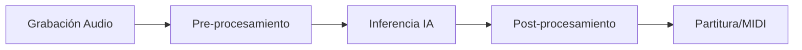
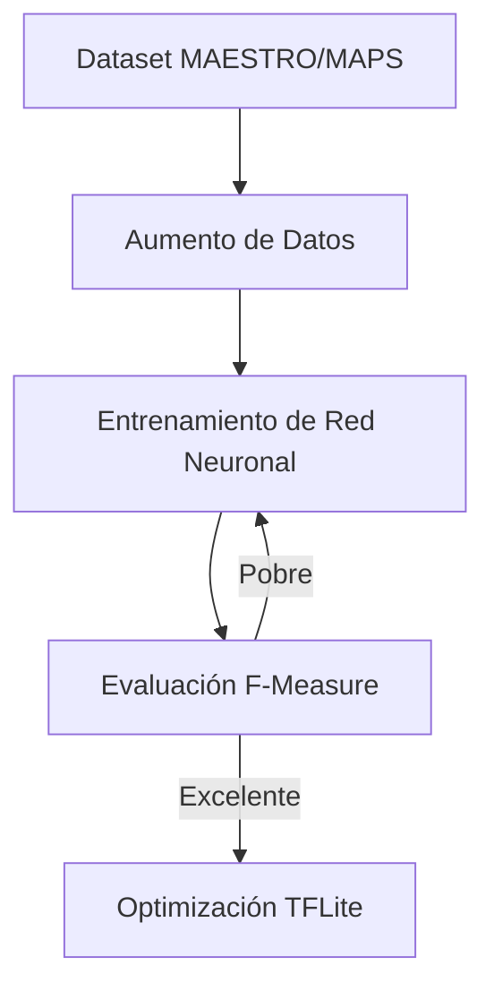

# Inteligencia Artificial en YanitaMusic

Este documento explica el proceso de **Transcripción Musical Automática (AMT)** y cómo se entrena el modelo de IA que utiliza la aplicación.

## 1. El Proceso de Transcripción (AMT)

La Transcripción Musical Automática es el proceso de convertir una señal de audio acústica en una representación simbólica (como MIDI o MusicXML). En YanitaMusic, este proceso sigue 5 pasos críticos.

### Detalle de los Pasos

1. **Pre-procesamiento**: El audio se resamplea a **16,000 Hz** en un solo canal (Mono). Luego se aplica una **STFT** (Transformada de Fourier de Tiempo Corto) para obtener un espectrograma Mel, que imita la percepción humana del sonido.
2. **Inferencia IA**: El modelo **Onsets and Frames** analiza el espectrograma. Identifica no solo qué frecuencias están presentes, sino el ataque inicial de cada nota (onset) para diferenciar entre una nota mantenida y una nota que se toca repetidamente.
3. **Post-procesamiento**: Las "predicciones" crudas de la IA son matrices de probabilidad. El sistema aplica umbrales y algoritmos de limpieza para evitar notas "fantasma".
4. **Exportación**: Los eventos de notas resultantes se convierten a formato MusicXML para visualización de partituras de alta calidad.

---

## 2. Entrenamiento del Modelo

El modelo no "aprende" en el teléfono; se entrena en servidores potentes (GPUs) antes de ser convertido a formato TFLite para su uso móvil.

### El Dataset Maestro
Un modelo de este nivel requiere miles de horas de audio etiquetado con precisión de milisegundos. Usamos principalmente el **MAESTRO Dataset** (MIDI and Audio Edited for Synchronous TRacks and Organization).
- **Contenido**: ~200 horas de interpretaciones de piano virtuoso de concursos internacionales.
- **Precisión**: Utiliza pianos Yamaha Disklavier que registran el MIDI exacto de la interpretación mientras se graba el audio.

### Ciclo de Entrenamiento

### Funciones de Pérdida (Loss Functions)

El modelo se entrena minimizando el error mediante:

- **Binary Cross Entropy**: Para los tensores de Onsets y Frames (¿Hay nota o no?).
- **Mean Squared Error (MSE)**: Para el tensor de Velocities (¿Qué tan fuerte se tocó?).

### Aumento de Datos (Data Augmentation)

Para que la IA funcione en el mundo real (con ruidos, eco, etc.), se le entrena con datos modificados:

- **Pitch Shift**: Cambiar el tono artificialmente.
- **Time Stretch**: Acelerar o ralentizar el audio.
- **Inyección de Ruido**: Añadir ruido blanco o ambiente.

---

## 3. Métricas de Calidad

¿Cómo sabemos si la IA es buena? Usamos métricas estándar de **MIR** (Music Information Retrieval):

- **Precisión (Precision)**: De todas las notas que la IA puso, ¿cuántas eran correctas?
- **Exhaustividad (Recall)**: De todas las notas que el pianista tocó, ¿cuántas detectó la IA?
- **F-Measure**: El promedio armónico entre Precisión y Recall. Nuestro objetivo es **> 0.75** en piezas monofónicas y **> 0.60** en piezas polifónicas complejas.

---
*Documentación técnica del motor de IA de YanitaMusic v53.*
