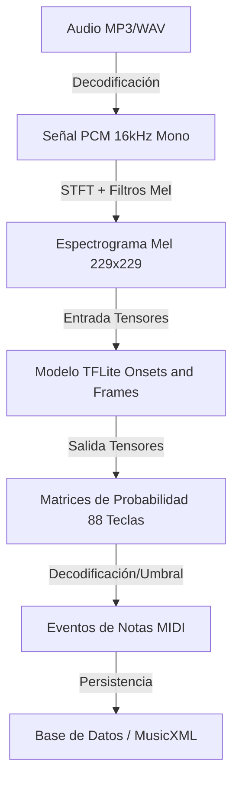
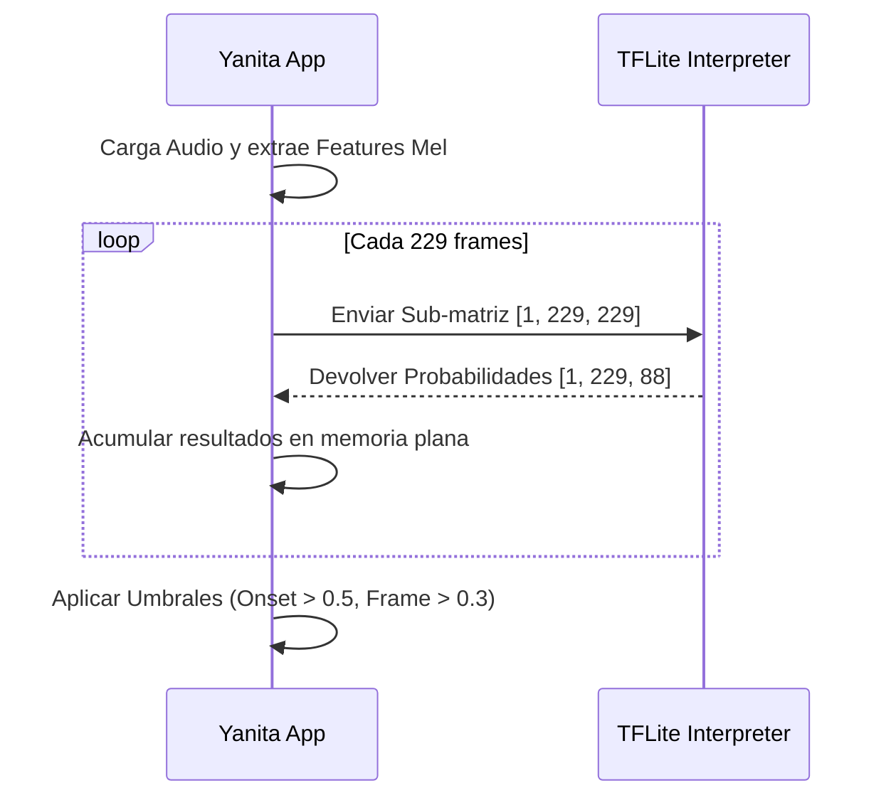
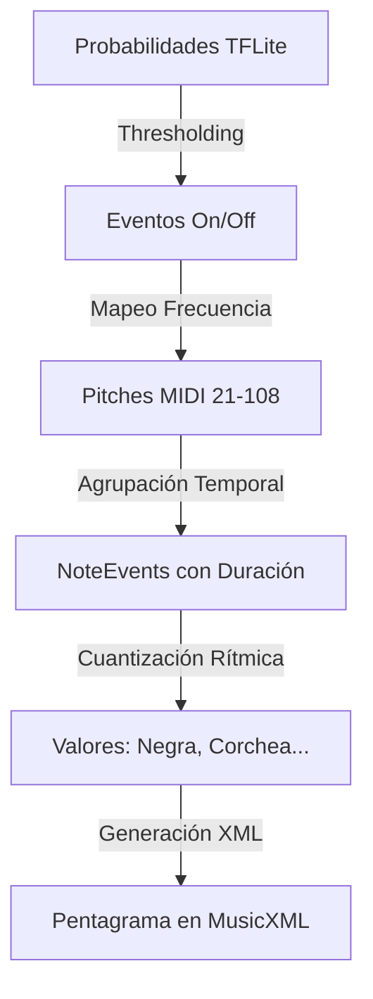

# Arquitectura de Tensores y Modelo TFLite

Este documento explica cómo funciona el modelo **Onsets and Frames** de TensorFlow Lite en YanitaMusic y cómo se procesan los datos a través de los tensores.

## 1. Flujo de Datos General

La transcripción musical utiliza un canal de procesamiento (pipeline) que convierte audio plano en eventos de notas MIDI.



## 2. El Modelo: Onsets and Frames

El modelo utilizado es una red neuronal profunda diseñada específicamente para la transcripción polifónica de piano. Se basa en el concepto de que detectar el **inicio** (onset) de una nota es más preciso que simplemente detectar si está sonando en un instante dado.

### Pilares de la Arquitectura (Multi-Stack)

1. **Onset Stack**: Detecta el momento exacto en que se golpea una tecla.
2. **Frame Stack**: Detecta la persistencia de la nota (cuánto tiempo se mantiene presionada).
3. **Velocity Stack**: Estima la intensidad (velocidad MIDI) de la nota.

---

## 3. Especificaciones de Tensores

### Entrada (Input Tensor)
El modelo espera una "imagen" de la energía sonora en el dominio de la frecuencia.

- **Formato**: `[Batch, Time, Frequency]`
- **Dimensiones**: `[1, 229, 229]`
  - `1`: Batch size (un fragmento a la vez).
  - `229`: Ventanas de tiempo (aprox. 2.3 segundos de audio).
  - `229`: Bandas de frecuencia Mel (cubriendo el rango del piano).
- **Tipo de dato**: `FLOAT32` (Normalizado).

### Salida (Output Tensors)
El modelo devuelve múltiples tensores (usando `runForMultipleInputs`). Cada uno representa una probabilidad por cada una de las **88 teclas** del piano.

| Tensor | Forma (Shape) | Descripción |
| :--- | :--- | :--- |
| **Onsets** | `[1, 229, 88]` | Probabilidad de inicio de nota en cada frame. |
| **Frames** | `[1, 229, 88]` | Probabilidad de que la nota esté sonando (sustain). |
| **Velocities** | `[1, 229, 88]` | Intensidad (0.0 a 1.0) de cada ataque detectado. |

---

## 4. Procesamiento Interno (Dentro de YanitaMusic)

Cuando enviamos los datos al motor TFLite, el código realiza lo siguiente:

### A. Preparación (Buffer Management)
Dado que el modelo tiene un tamaño fijo de entrada (229 frames), si el audio es más largo, lo dividimos en fragmentos:



### B. Lógica de Decodificación de Salida
Para decidir si una nota es real, el sistema combina los tensores de salida:

> [!IMPORTANT]
> Una nota se activa **solo si** hay un pico de probabilidad en el tensor de **Onsets**. Una vez activada, se mantiene "viva" mientras la probabilidad en el tensor de **Frames** sea alta. Esto evita el "parpadeo" de notas.

```dart
// Ejemplo conceptual de la lógica de decisión
if (onsetProb > 0.5 && onsetProb > prevOnsetProb) {
   // Iniciamos nueva nota MIDI
   iniciarNota(midiNote, time);
} else if (activeNote && frameProb < 0.3) {
   // Terminamos la nota actual
   finalizarNota(midiNote, time);
}
```

## 5. De Notas a Pentagrama: El Salto Simbólico

Una vez que el modelo TFLite entrega las probabilidades, YanitaMusic realiza una serie de pasos para que esa información se convierta en una partitura legible (Pentagrama).



### El Proceso de Interpretación

1. **Detección de Altura (Pitch)**: El índice del tensor de salida `[0..87]` se suma a 21 (la nota más baja del piano, A0) para obtener el valor MIDI estándar.
2. **Cálculo de Duración**: Se mide el tiempo transcurrido entre el `Onset` detectado y el momento en que la probabilidad del `Frame` cae por debajo del umbral (0.3). Esto define si es una blanca, negra, etc.
3. **Cuantización**: La IA detecta tiempos exactos en milisegundos (ej: 498ms). El sistema de interpretación lo "ajusta" al compás más cercano (ej: 500ms -> una negra a 120BPM) para que el pentagrama no se llene de silencios extraños.
4. **MusicXML**: Finalmente, estos datos se inyectan en una estructura XML que define la clave (Sol/Fa), la armadura y la disposición de las notas en el pentagrama.

---

## 6. Optimización en YanitaMusic

Para evitar que la interfaz de usuario se congele (ANR), YanitaMusic ejecuta este proceso en un **Isolate** (hilo separado).

1. El hilo principal envía el buffer del modelo y los datos de audio procesados al Isolate.
2. El Isolate inicializa su propio `Interpreter`.
3. Ejecuta el bucle de inferencia.
4. Devuelve únicamente la lista final de `NoteEvent` al hilo principal para ser mostrados en la partitura.

---

*Documentación técnica actualizada v53.*
