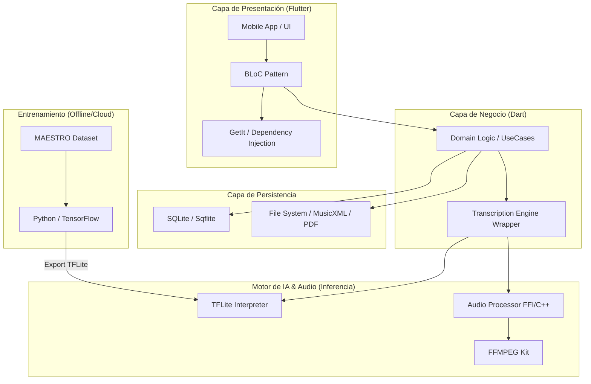

# YanitaMusic - Stack Tecnológico

Este documento resume las tecnologías, arquitecturas y herramientas utilizadas en el desarrollo de **YanitaMusic**, un ecosistema de transcripción musical impulsado por IA.

## Diagrama del Ecosistema

## 1. Frontend & Mobile App

- **Core Framework**: [Flutter](https://flutter.dev/) (SDK ^3.11.1)
- **Lenguaje**: Dart
- **Arquitectura**: Clean Architecture (Data, Domain, Presentation layers).
- **Gestión de Estado**: Patrón BLoC (`flutter_bloc`, `bloc`).
- **Inyección de Dependencias**: `get_it` con generación automática mediante `injectable`.

## 2. Inteligencia Artificial (Motor de Transcripción)

- **Inferencia en Dispositivo**: [TensorFlow Lite](https://www.tensorflow.org/lite) (`tflite_flutter`).
- **Modelo**: **Onsets and Frames** (Redes Neuronales Profundas para transcripción polifónica de piano).
- **Pipeline de Datos**:
  - **Pre-procesamiento**: Audio Resampling (16kHz Mono) + STFT + Mel Spectrogram.
  - **Inferencia**: Procesamiento por fragmentos de 229 frames (aprox 2.3s).
  - **Post-procesamiento**: Umbralización de probabilidades (Thresholding) y limpieza de notas.
- **Entrenamiento**: Servidores basados en Python (TensorFlow) utilizando el **MAESTRO Dataset**.

## 3. Procesamiento de Audio & Multimedia

- **Bibliotecas de Audio**: `just_audio`, `audioplayers`, `record`.
- **Procesamiento Nativo**: Puente C++ vía **Dart FFI** para operaciones intensivas (filtros, FFT).
- **Herramientas de conversión**: `ffmpeg_kit_flutter_new_audio`.
- **Exportación**:
  - **Simbólico**: MusicXML (`xml`).
  - **Documentos**: Reportes en PDF (`pdf`).

## 4. Almacenamiento & Seguridad

- **Base de Datos Local**: SQLite (`sqflite`) para persistencia offline de partituras (Score) y metadatos.
- **Seguridad**: `flutter_secure_storage` para datos sensibles, `encrypt` y `crypto` para integridad de archivos.

## 5. Infraestructura de Desarrollo

- **Backend**: Offline-first (No requiere conexión constante para transcripción).
- **Generación de Código**: `build_runner`, `injectable_generator`, `ffigen`.
- **Tests**: `flutter_test`, `integration_test`, `bloc_test`, `mockito`.

---

**Generado automáticamente por Antigravity v1.0**
