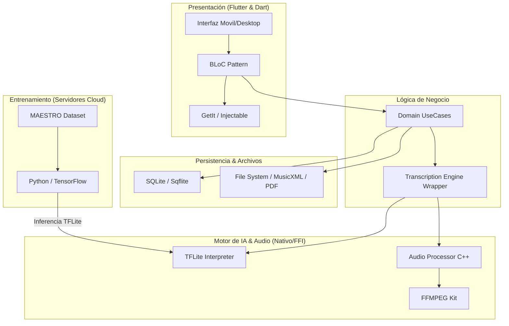

# YanitaMusic - Documentación Integral del Stack Tecnológico

Este documento proporciona una visión profunda y técnica de todo el ecosistema de **YanitaMusic**, detallando desde la interfaz de usuario hasta el motor de inferencia de IA y la persistencia de datos.

## 1. Arquitectura del Ecosistema

El sistema sigue una arquitectura de capas (Clean Architecture) orientada a la ejecución offline y el alto rendimiento en procesamiento de señales.

---

## 2. Frontend & Aplicación (Dart/Flutter)

- **Framework**: Flutter (SDK ^3.11.1).
- **Patrón de Estado**: [BLoC](https://pub.dev/packages/flutter_bloc) para una separación clara de la lógica de negocio y la interfaz.
- **Inyección de Dependencias**: [GetIt](https://pub.dev/packages/get_it) con [Injectable](https://pub.dev/packages/injectable) para automatizar el registro de servicios.
- **Tipado & Estructura**: Uso de `equatable` para comparación de estados y `dartz` para programación funcional (Either, Option).

---

## 3. Inteligencia Artificial (AMT Engine)

### El Modelo: Onsets and Frames
Utilizamos una arquitectura de red neuronal compleja optimizada para la **Transcripción Musical Automática (AMT)**.

- **Stack Multi-Tarea**:
  - **Onset Stack**: Detecta el inicio preciso de la pulsación de la tecla.
  - **Frame Stack**: Identifica la duración y el sostenimiento de la nota.
  - **Velocity Stack**: Estima la fuerza (0-127 MIDI) del impacto.
- **Especificaciones TFLite**:
  - **Entrada**: Espectrograma Mel de `[1, 229, 229]` (Frecuencia vs Tiempo).
  - **Salidas**: 3 tensores de `[1, 229, 88]` (Probabilidades por cada una de las 88 teclas del piano).
  - **Umbrales**: Onset > 0.5, Frame > 0.3 (Ajustado para evitar falsos positivos).

### Métricas de Calidad
- **F-Measure**: Objetivo > 0.75 en piezas estándar.
- **Latencia**: Ejecución en tiempo real mediante un **Isolate** separado para no bloquear la interfaz.

---

## 4. Persistencia de Datos (SQLite)

La base de datos local gestiona la organización de la música y el historial de transcripciones.

- **Tecnología**: [sqflite](https://pub.dev/packages/sqflite) / [sqlflite_common_ffi].
- **Esquema Principal**:
  - **Songbooks**: Colecciones organizadas de canciones.
  - **Scores**: Almacena los resultados de la IA (Eventos de notas, MusicXML, metadatos).
  - **Transcriptions**: Registro detallado de cada ejecución histórica.

---

## 5. Procesamiento de Señal & Multimedia

- **Pre-procesamiento**: El audio se decodifica y resamplea a **16,000 Hz Mono**.
- **Puente Nativo**: Uso de **Dart FFI** para invocar código C++ que realiza cálculos de Transformada de Fourier (FFT) de alta eficiencia.
- **Formatos de Salida**:
  - **MusicXML**: Para visualización de partituras dinámicas.
  - **PDF**: Reportes estáticos y documentos de espectrogramas.
  - **MIDI**: Para integración con estaciones de trabajo de audio digital (DAW).

---

## 6. Seguridad & Operación Offline

- **Seguridad de Datos**: Encriptación mediante `crypto` y `encrypt`. Almacenamiento seguro de claves con `flutter_secure_storage`.
- **Modo Offline**: Todo el proceso de inferencia de IA se realiza **localmente** en el dispositivo, garantizando privacidad y disponibilidad sin internet.

---
*Documentación Técnica Consolidada v53 - YanitaMusic*
