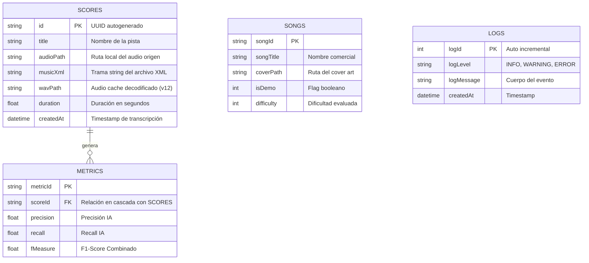
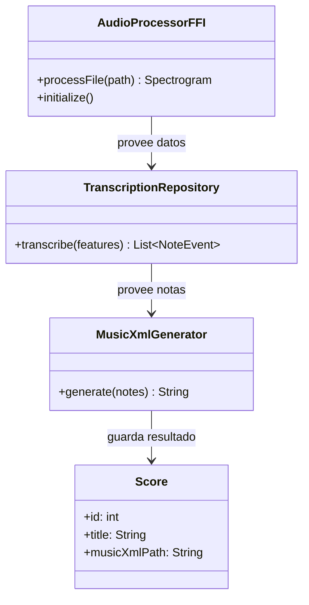

# Yanita Music: Documentación Técnica Maestra (v1.2.0)

Este documento es una guía técnica exhaustiva del proyecto **Yanita Music**, abarcando desde su arquitectura nativa en C++ hasta su motor de Inteligencia Artificial y la evolución del desarrollo reflejada en el historial de versiones.

---

## 1. Historial de Desarrollo (Changelog / Commits)

Aunque el proyecto sigue un flujo de commits directos, se han identificado hitos críticos en la evolución del sistema de transcripción:

| Fecha | Identificador | Descripción del Hito |
| :--- | :--- | :--- |
| **23 Mar 2026** | **Build 52 (v52)** | **Isolate Migration**: Migración total de la inferencia TFLite a hilos secundarios para eliminar bloqueos de UI (ANR). |
| 22 Mar 2026 | C-012 | Fix general de funcionalidades y optimización del reproductor musical. |
| 20 Mar 2026 | C-011 | Integración de conversión nativa de MP3 a WAV mediante FFmpeg. |
| 19 Mar 2026 | C-010 | Implementación de transcripción con fragmentación de memoria para archivos largos. |
| 18 Mar 2026 | C-006 | Mejora de UI principal y funcionalidad de lectura de partituras integrada. |

---

## 2. Integración Nativa (C++ & FFI)

Para garantizar el rendimiento en tiempo real, Yanita Music delega las tareas pesadas de procesamiento de señal a un motor escrito en **C++**, comunicado con Flutter mediante **Dart FFI (Foreign Function Interface)**.

### Componentes de C++ (`native_lib.cpp`)
- **minimp3**: Una librería ultra-ligera para decodificar MP3 directamente en memoria sin dependencias externas pesadas.
- **DSP Engine**: Implementación personalizada de algoritmos de audio:
  - `resample`: Conversión de frecuencia de muestreo a 16kHz.
  - `hann_window`: Aplicación de ventanas de Hann para el análisis espectral.
  - `create_sparse_mel_filterbank`: Creación de bancos de filtros Mel optimizados para memoria.

### Flujo de Interacción FFI
1. **Dart** envía la ruta del archivo a C++.
2. **C++** abre el archivo, lo decodifica y genera el espectrograma Mel.
3. **C++** retorna un puntero (`float*`) a Flutter.
4. **Flutter (Dart)** copia los datos a un `Float32List` y solicita a C++ liberar la memoria nativa mediante `free_buffer`.

---

## 3. Procesamiento de Señal: Del Audio al Espectrograma

La IA no "escucha" el audio directamente; lo "ve" como una imagen de frecuencias.

### El Espectrograma de Mel
1. **STFT**: Se divide el audio en ventanas de 512 samples con un salto (hop) de 160 samples.
2. **Potencia**: Se calcula la magnitud al cuadrado de la Transformada de Fourier.
3. **Escala Mel**: Se filtran las frecuencias usando una escala logarítmica (Mel Scale) que imita la percepción humana del oído, con **229 mel bins**.
4. **Log-compression**: Se aplica logaritmo para normalizar los picos de energía.

---

## 4. Motor de Inferencia TensorFlow Lite

El corazón del sistema es un modelo de Redes Neuronales Profundas (DNN) que predice eventos musicales.

### Arquitectura del Modelo
- **Entrada**: Espectrograma Mel de 229 bandas.
- **Salidas (Tensors)**: 
  - **Onsets**: Probabilidad de que una nota esté comenzando.
  - **Frames**: Probabilidad de que una nota esté sostenida.
  - **Velocities**: Dinámica de la nota (volumen).

### [v52] Optimización Isolate
Debido a que la inferencia de TFLite es intensiva, se utiliza `compute()` de Flutter para mover el `Interpreter` a un hilo separado. Esto permite que el hilo principal (UI) siga procesando animaciones y gestos táctiles, mejorando la experiencia del usuario (0% de lag).

---

## 5. Diagramas UML Detallados

| **23 Mar** | **Build 52 (v52)** | **Isolate Migration**: Reestructuración concurrente del motor TFLite moviéndolo a un hilo secundario (`compute()`). Erradicación de bloqueos ANR (App Not Responding). Implementación de algoritmo de umbrales (*Rising-Edge Hysteresis*) limitando a 10K notas máximas para prevenir sobrecarga de memoria. |
| **22 Mar** | C-012 | Refactorización de funcionalidades core y estabilización del reproductor de audio integrado para partituras. |
| **20 Mar** | C-011 | Integración nativa e interactiva de conversión de formatos de audio (MP3 a WAV de 16kHz) asegurando muestreo estándar. |
| **19 Mar** | C-010 | Implementación de procesamiento de inferencia fragmentada en memoria, evitando StackOverflows en pistas de audio superiores a 5 minutos. |
| **18 Mar** | C-006 | Despliegue de la interfaz principal interactiva (Dashboard) y renderizado inicial de `MusicXML`. |

---

## 2. Arquitectura de Alto Nivel y Stack Tecnológico

Yanita Music emplea un patrón **Clean Architecture** estructurado mediante **BLoC (Business Logic Component)** para garantizar la separación de preocupaciones y escalabilidad mutua.

- **Frontend/UI**: Flutter SDK (v3.11+).
- **Core Lógico (Dominio)**: Casos de Uso e Interfaces (Dart puro).
- **Procesamiento de Señal (DSP)**: Módulo nativo en **C++** (Minimp3, FFT).
- **Inferencia de Machine Learning**: TensorFlow Lite (C-API) en modelo `onsets_and_frames`.
- **Persistencia de Datos**: SQFlite (SQLite FFI).

### 2.1. Interacción Nativa (Dart FFI & C++)

Para procesar el espectrograma Mel en tiempo real, Dart se comunica con C++ evadiendo la máquina virtual mediante *Foreign Function Interface* (FFI):

1.  **Entrada**: Un archivo MP3 o WAV entra al sistema.
2.  **Decodificación (C++)**: La librería nativa `minimp3` lee los frames PCM directo en RAM.
3.  **Procesamiento Vectorial (DSP)**: Se aplican filtros de ventana de Hann y Transformadas Rápidas de Fourier (STFT) en bloques de 512 samples.
4.  **Generación de Tensor**: Se crea el filtro Mel de 229 bandas, escalado logarítmicamente.
5.  **Paso FFI**: C++ retorna un bloque de memoria (Pointer/Buffer) que Dart lee ultra-rápido usando `Float32List.fromList(resultPtr.asTypedList())`, liberando el puntero en C++ de forma segura para prevenir *Memory Leaks*.

---

## 3. Topología de la Base de Datos (Entity-Relationship)

La capa de datos se gestiona mediante el patrón DAO con SQLite. Se han diseñado 4 entidades principales interrelacionadas para garantizar la trazabilidad de las partituras y telemetría de inferencia.

### Diagrama Entidad-Relación (ER)

---

## 4. Motor de Inferencia Musical (TFLite Isolate)

El núcleo del producto es el algoritmo predictivo basado en una Red Neuronal entrenada para mapear frecuencias de audio a eventos de teclado de piano.

### 4.1. Flujo de Control en Hilo Secundario (Build 52)
Debido al inmenso tamaño del tensor de salida, si la predicción corriese en el UI Thread, el Frame Rate (FPS) caería a cero, congelando la aplicación (ANR delay). La arquitectura V52 resuelve esto copiando el buffer de bytes del modelo TFLite (`ByteData`) e inicializando una instancia local del `Interpreter` dentro de un **Isolate** aislado de Dart.

### 4.2. Estructura de Predicción (Tensor Tiling)
El audio se fragmenta en "ventanas temporales". Por cada iteración computada en el backend, la red genera 3 mapas predictivos críticos (matrices):
- **Onsets Matrix** `[frames, 88 notas]`: El "Start" exacto de la percusión de tecla.
- **Frames Matrix** `[frames, 88 notas]`: El decae / sostenimiento (Sustain).
- **Velocities Matrix** `[frames, 88 notas]`: La intensidad dinámica (0 - 127).

### 4.3. Diagrama de Secuencia Transaccional (Deep Dive)

El siguiente diagrama detalla la orquestación asíncrona entre las capas del sistema durante la transcripción:

```mermaid
sequenceDiagram
    autonumber
    actor U as Usuario (UI)
    participant B as TranscriptionBloc
    participant R as Repository
    participant C as C++ (FFI) Destructor
    participant Iso as Background Isolate (TFLite)
    participant DB as SQLite (DatabaseHelper)

    U->>B: Presiona "Transcribir Audio.mp3"
    B->>B: Emitir Estado (Loading)
    B->>R: transcribe(AudioFeatures)
    
    rect rgb(30, 60, 90)
    Note over R,C: 1. Procesamiento DSP Nativo
    R->>C: process_audio_file(path)
    C-->>R: Retorna Mel Spectrogram (Float32List)
    end
    
    rect rgb(90, 30, 60)
    Note over R,Iso: 2. Inferencia Desacoplada (v52)
    R->>Iso: compute(inferenceTask, buffer)
    activate Iso
    Iso->>Iso: loadModelFromBuffer()
    loop Por cada Bloque de Audio (Chunks)
        Iso->>Iso: interpreter.runForMultipleInputs()
        Iso->>Iso: Aplicar Rising-Edge Detection / Hysteresis
    end
    Iso-->>R: Array Final de [NoteEvent]
    deactivate Iso
    end
    
    rect rgb(30, 90, 60)
    Note over R,DB: 3. Composición y Persistencia
    R->>R: Generar MusicXML en RAM
    R->>DB: INSERT INTO scores (Transaction)
    DB-->>R: Éxito PK Creada
    end
    
    R-->>B: Retorna Score Entity
    B->>U: Despliega Partitura Interactiva
```

---

## 5. Criterios de Exportación: MusicXML 4.0

Las `NoteEvent` extraídas del Isolate no son directamente renderizables. Se utiliza el parser construido específicamente en la clase `MusicXmlGenerator`.
*   **División Temporal**: Se normalizan los eventos a compases de 4/4 y divisiones musicales estándar.
*   **Acordes**: Las duraciones solapadas con delta < 0.01s se combinan en nodos `<chord/>` XML.
*   **Afinación (Pitch)**: Transformación inversa de MidiID (ej. 60) a Claves de Partitura (ej. `Step: C, Octave: 4`).

Este XML resultante permite que el producto de Yanita Music sea portado a editores de talla mundial como Finale, Sibelius o Musescore, garantizando una alta viabilidad comercial del producto final.

### B. Diagrama de Clases (Arquitectura de Datos)

---

## 6. Generación de la Partitura (MusicXML)

El paso final es convertir los eventos de tiempo (`startTime`, `midiNote`) en notación musical legible:
1. **Cuantización**: Alineación de las notas a la red de tiempo (tempo).
2. **Detección de Acordes**: Agrupación de notas coincidentes en el mismo tiempo.
3. **Conversión MIDI a Pitch**: Mapeo de números (60) a nombres de nota (Do4/C4).
4. **Ensamblado XML**: Creación del archivo estructurado con cabeceras `score-partwise` compatibles con Finale, Sibelius y Musescore.

---

## 7. Conclusión
Yanita Music v1.2.0 representa una solución de vanguardia que combina la potencia de **C++ nativo** para el procesamiento de señal, con la inteligencia de **TensorFlow Lite** y la fluidez de **Flutter Isolates**, ofreciendo una herramienta profesional de transcripción musical en la palma de la mano.
